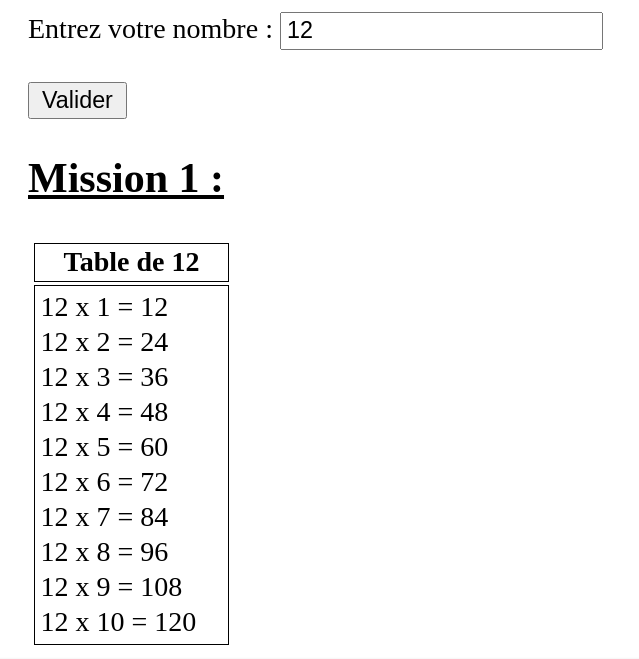
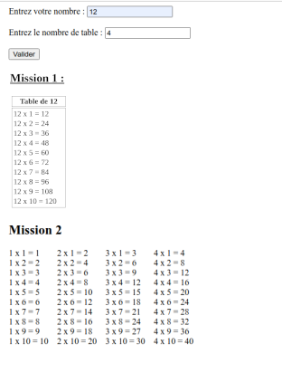

# Multiplication

## Explication de la Mission 1 : 
La mission 1 consiste à concevoir une application web qui affiche une table de multiplication (1 à 10), selon une valeur soumise par l’utilisateur.

### Exemple :  
L'utilisateur saisi le chiffre 12, le programme devra donc afficher     
12 x 1 = 12    
...     
12 x 10 = 120  

## Affichage pour la mission 1 :       



## Explication des Components :  

Lors de la mission 1 le projet contient 2 components.    

- Component parent : AppComponent    
- Component enfant : Table-Multiplication   

### Schéma UML : 

.... 

## Explication du Code 

### Récupération des données 

```html
<!-- app.component.html-->
<label>Entrez votre nombre : </label>
<input name="nb" type="number" placeholder="Chiffre" [(ngModel)]="nb">
<button (click)="submits()">Valider</button>
```

```ts
// app.component.ts
ngOnInit(): void {
this.identForm = new FormGroup({ nb: new FormControl('') });
}
get formControls() { return this.identForm.controls; }

submits(){
this.isSubmitted = true;
}
```

NgModel : Correspond à la valeur de tape l'utilisateur en temps réel   

Lorsque l'utilisateur click sur le bouton Valider la méthode submits() s'exercutera et rendra la variable isSubmitted en true ce qui nous servira par valider l'affichage de la table de multiplication que l'utilisateur a choisi.    

### Validation d'afficher la table de Multiplication

```html
<!-- app.component.html-->
<div *ngIf="number(); then submit"></div>
  <ng-template #submit>
    <h2>Mission 1 : </h2>
    <table>
      <app-table-multiplication [number]="nb"></app-table-multiplication>
    </table>
  </ng-template>
```

Lorsque la méthode number() renvoi true la table de multiplication s'affichera.   

```ts
// app.component.ts
number(){
    
    if(this.nb != 0 && this.isSubmitted == true ){
        this.isSubmitted = false; // Obligera l'utilisateur a rappuyer sur le bouton Valider pour faire une modification
        return true;
    }
    else{
        return false;
    }
}
```

Comment fonctionne la validation :   
Pour accepter la validation en renvoyant true, il faut que le nombre saisis par l'utilisateur (nb) soit différent de 0 et que le bouton Valider soit valider par l'utilisateur.  

### Affichage de la table de multiplication

```html
<!-- app.component.html-->
<table>
      <app-table-multiplication [number]="nb"></app-table-multiplication>
</table>
```

```ts
// table-multiplication.ts
@Input()
number!: number;

tabNum = [1,2,3,4,5,6,7,8,9,10];
i = 0;
resultat = 0;
tabResultat = [];

ngOnInit(): void {
  for (this.i; this.i < this.tabNum.length; this.i++) {
    this.resultat = this.tabNum[this.i] * this.number;
    this.tabResultat.push(this.resultat);      
  }
}


```
```html
<!-- table-multiplication.html-->
<tr>
  <th>Table de {{number}}</th>
</tr>
<td style="padding-right: 1em;">
  <tr *ngFor="let nb of tabNum">{{number}} x {{nb}} = {{tabResultat[nb - 1]}}</tr>
</td>
```

La variable number a étais initier grâce à l'exportation de la variable nb (la valeur choisie par l'utilisateur) du component parent app-component.    

tabNum est un tableau contenant les chiffres de 1 à 10, il nous servira pour faire les lignes de la table de multiplication.    

tabResultat correspond comme son nom l'indique, à un tableau contenant tous les résultats.

## Explication de la Mission 2 :
La mission 2 consiste à affiche les tables de multiplication de 1 à x, selon une valeur soumise par l’utilisateur.

### Exemple :
L'utilisateur saisi le chiffre 3, le programme devra donc afficher     

1 x 1 = 1   
...     
1 x 10 = 10

2 x 1 = 2   
...     
2 x 10 = 20

3 x 1 = 3   
...     
3 x 10 = 30

## Affichage pour la mission 2 :



## Explication des Components :

Lors de la mission 2 le projet contient 3 components.

- Component parent : AppComponent
- Component parent et enfant : Tables-Multiplication
- Component enfant : Table-Multiplication

### Schéma UML :

....

## Explication du Code 
```ts
@Input()
nbTab!: number;

i = 1;
tabNum = new Array();

ngOnInit(): void {
    for (this.i; this.i <= this.nbTab; this.i++) {
        this.tabNum.push(this.i);      
    }
}
```
```html
<!-- tables-multiplication.html-->
<app-table-multiplication *ngFor="let nb of tabNum" [number]="nb"></app-table-multiplication>
```

Nous réutilisons le component de la mission 1 (table-multiplication) en lui donnant comme argument la 1 puis 2 puis .... jusqu'à le nombre de table que l'utilisateur veut.  
